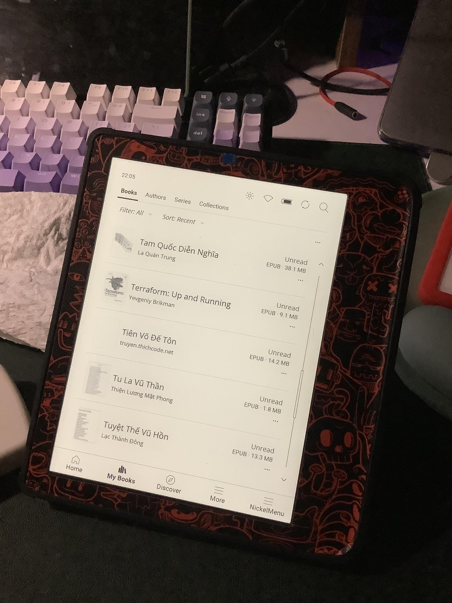

# b0ttle-kobo

all things related to Kobo Reader

---

## 1. Font tiếng Việt title sách trong Mybook

- copy `KoboRoot.tgz` to ***.kobo/***
- Result

## 2. Install dictionary
https://github.com/thanhbinh030296/kobo-tieng-viet
